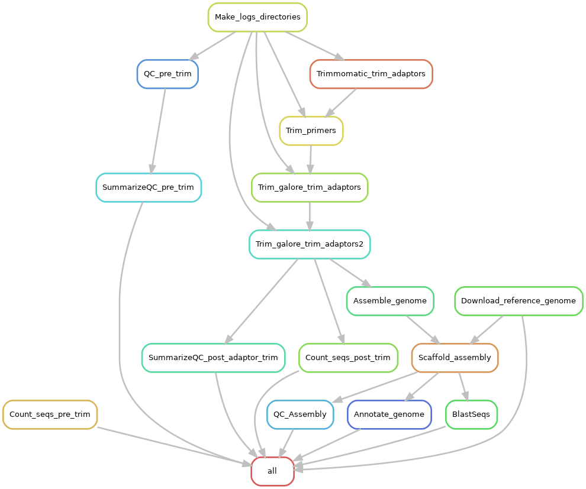

# Snakemake Workflow: Microbial genome assembly. 

This workflow performs microbial genome assembly using spades or megahit, scaffolds the draft assembly using RagTag and annotates the scaffolds using Prokka and BLAST. 

Please note the following:

1. Annotation using pgap is still a work in progress. So do not use it for now.
2. I will be be happy to fix any bug that you migth find, so please feel free to reach out to me at obadbotanist@yahoo.com

Please do not forget to cite the authors of the tools used.

**The Pipeline does the following:**

- Quality checks, summarizes and counts the input reads using FASTQC, MultiQC and seqkit
- Trims off primers and adapters using a combination of Trimmomatic and Trimgalore
- Quality checks, summarizes and counts the trimmed reads using FASTQC, MultiQC and seqkit
- Assembles the clean reads using either spades or megahit
- Downloads a references to be used for scaffolding by RagTag using entrez tools and seqret
- Scaffolds the draft assembly using RagTag
- Quality checks the scaffold assembly using QUAST
- Annotates the assembly using Prokka and BLAST

## Authors

* Olabiyi Obayomi (@olabiyi)

Before you start, make sure you have all the required software installed. You can optionally install my bioinfo environment which contains snakemake and many other useful bioinformatics tools.

- miniconda
- snakemake
- multiqc
- fastqc
- parallel
- trim_galore
- cutadapt
- trimmomatic
- seqkit
- blast
- spades
- megahit
- quast
- prokka
- pgap (not yet fully implemented)

### STEP 1:  Install miniconda  (optional)

See instructions on how to do so [here](https://conda.io/projects/conda/en/latest/user-guide/install/index.html)

### Step 2: Install bioinfo environment (optional)

If you would like to use my bioinfo environment:

	conda env create -f envs/bioinfo.yaml  && pip install RagTag

### Step 3: Obtain a copy of this workflow

	git clone https://github.com/olabiyi/snakemake-genome-assembly.git

### Step 4: Configure workflow

Configure the workflow according to your needs by editing the files in the `config/` folder. Adjust `config.yaml` to configure the workflow execution.

### Step 7:  Running the pipeline

#### Activate the conda environment containing snakemake  

	source activate bioinfo

#### Set-up the mapping file and raw data directories

    [ -d 01.raw_data/ ] || mkdir 01.raw_data/

#### Move your raw data to the 01.raw_data directory 
    # Delete anything that may be present in the rawdata directory
    rm -rf  mkdir 01.raw_data/*
    # Move your read files to the rawa data directory - Every isolate in its own directory - see the example in this repo
	# this pipeline assumes that all the isolate come from one reference microbial geneome
	mv  location/rawData/isolates/* 01.raw_data/

#### gzip fastq files if they are not already gziped as required by this pipeline. It also helps to save disk memory.

	find 01.raw_data/ -type f -name '*.fastq' -exec gzip {} \;

#### Executing the Workflow
	
	snakemake -pr --cores 10 --keep-going --rerun-incomplete

